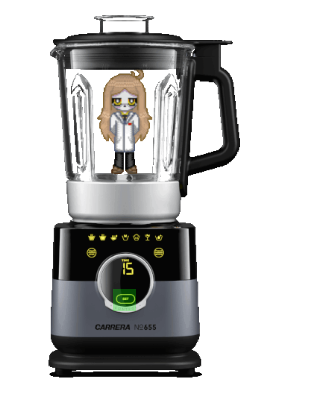

# Licuadora
Práctica realizada para la clase de programación web.

## Funcionamiento

La Licuadora se activa dándole click al botón translucido ubicado donde usualmente se activa una licuadora física.

## Acceso
Puede acceder al proyecto mientras este activo en github pages, sino con refined github darle a preview.

## Screenshot
